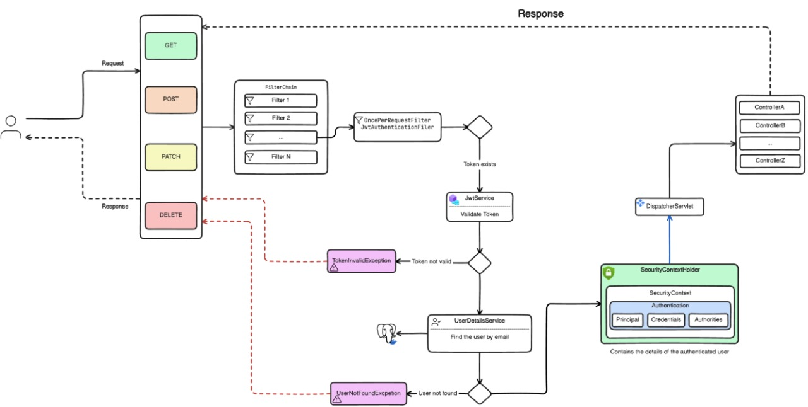

## StuConnect

### Description
StuConnect is a comprehensive platform aimed at connecting students across different colleges, providing a range of features to facilitate communication, collaboration, and networking. Whether it's sharing study materials, organizing events, or simply connecting with peers from other institutions, StuConnect aims to be the go-to solution for student interaction.

### Table of Contents
1. [Installation](#installation)
2. [Usage](#usage)
3. [Folder Structure](#folder-structure)
4. [Technologies Used](#technologies-used)
5. [Diagrams](#diagrams)

### Installation
To get started with StuConnect, follow these steps:

- **Frontend**
  - Clone the repository:
    ```
    git clone https://github.com/yourusername/stuconnect.git
    ```
  - Navigate to the frontend directory:
    ```
    cd stuconnect/frontend
    ```
  - Install dependencies:
    ```
    npm install
    ```
  - Start the development server:
    ```
    npm start
    ```

- **Backend**
  - Clone the repository:
    ```
    git clone https://github.com/yourusername/stuconnect.git
    ```
  - Navigate to the backend directory:
    ```
    cd stuconnect/backend
    ```
  - Install dependencies:
    ```
    mvn clean install
    ```
  - Run the application:
    ```
    java -jar target/stuconnect.jar
    ```

### Usage
Once the installation is complete, you can start using StuConnect:

- **Frontend**
  - The main entry point for the frontend is `app.jsx`.
  - `layout.jsx` provides the basic layout structure for the application.
  - `index.css` contains the global styles for the application.
  - `main.jsx` serves as the main JavaScript file.
  - Additional pages and components can be found in the `components` folder.
  - Images and written text resources are located in the `lib` folder.

- **Backend**
  - The backend is powered by Java with Maven as the build tool.
  - `src` contains templates and configuration files.
  - `application-dev.yml` and `application.yml` store application configurations.
  - `.eslintrc.cjs`, `components.json`, `index.html`, `jsconfig.json`, `package-lock.json`, and `package.json` are essential files for development and deployment.

### Folder Structure
- **frontend**
  - `components/`
  - `lib/`
  - `app.jsx`
  - `layout.jsx`
  - `index.css`
  - `main.jsx`
- **backend**
  - `src/`
    - `templates/`
    - `application-dev.yml`
    - `application.yml`
  - `mvn-wrapper/`
    - `maven-wrapper.jar`
    - `maven-wrapper.properties`
  - `.eslintrc.cjs`
  - `components.json`
  - `index.html`
  - `jsconfig.json`
  - `package-lock.json`
  - `package.json`

### Technologies Used
- **Frontend**: React, JavaScript, Tailwind CSS
- **Backend**: Java, Maven, Spring Boot

### Diagrams

- **Backend Pipeline**
  

- **Spring Security Diagram**
  

By following these steps and utilizing the provided resources, you can effectively set up and start working with StuConnect. For any further assistance or queries, please refer to the documentation or contact the support team.
